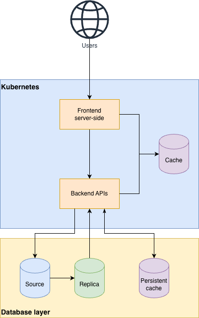

# Architectural Design

## High level

1. Softare application layer:
    1. *Frontend server-side*: the containers for Frontend, we use Server-side Rendering.
    2. *Backend APIs*: the containers of Backend API.
    3. *Cache*: this containers are used for cache to improve the performance of the system, we don't store the persistent data in this component. We can use Redis and configure it not to use the hard disk.
4. Database layer:
    1. *Source* & *Replica* are the replication of the main database, we can use PostgreSQL.
    2. *Persistent cache* we can use Redis to store the persistent data in cache (if it is necessary). This component is optional.

We use Kubernetes (or at least K3s for the non-production environments) for software application layer for high availability.

## Caching Strategy

1. Read: Cache aside
2. Write: Write around variant, we invalidate cached data instead update them.
3. Time to live for a key: from 1 to 5 minutes.

## Technical stack

1. Docker of podman to containerize the software
2. Programming language: Go
3. Database: PostgreSQL
4. Caching: Redis

## API constraints

1. The RESTFul API:
   1. Request in POST or PUT is a JSON object.
   2. Reponse is a JSON object. The responses contain:
      1. `error`: integer, `0` if it is a successful response, `error != 0` if there is any error.
      2. `message`: string, a message for response.
      3. `data`: the main data for response, a JSON object.
         1. If the request is inserting updating, it is the latest state of the record.
         2. If the request is getting a record, the JSON object is the record.
         3. If the request if getting a list, the a object has:
            1. `total`: number of records that match the query.
            2. `page_size`: number of records per page
            3. `page`: the current page
2. Money, pricing or Decimal data will be returned as string.
3. Datetime using ISO-8601 format.